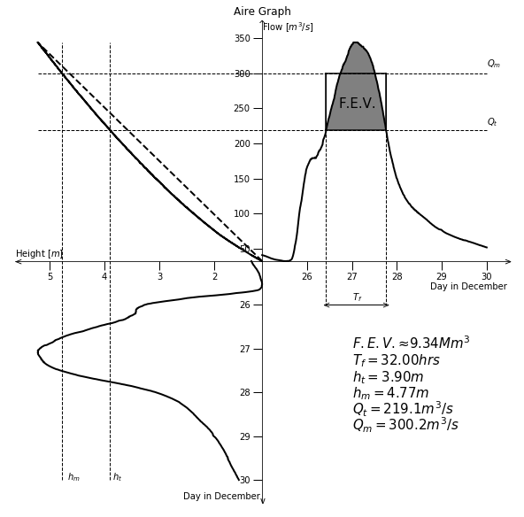

# Math3001 Rivers Project
This is the area we will create our blog on river mitigation strategies best suited to each explored river.

## Intro to GitHub 

Writing in Github: search google  'git markdown syntax'. 
For example: [markdown cheat sheet](https://github.com/adam-p/markdown-here/wiki/Markdown-Cheatsheet). Also have a look at raw README.md code in TK's [modRSW_EnKF repository](https://github.com/tkent198/modRSW_EnKF). 

For a more in-depth introduction to GitHub, see [here](http://www.geog.leeds.ac.uk/courses/computing/practicals/general/github/index.html). This may seem daunting at first but it is worth getting to grips with the basics now to make life easier in the future -- that goes for me too!

Overview of key commands from terminal: [here](https://services.github.com/on-demand/downloads/github-git-cheat-sheet.pdf) and [here](https://education.github.com/git-cheat-sheet-education.pdf).

### Smaller Heading

Try adding text, figures, code, etc, here so we can share everything and start building up a log of your work. 

### Rivers Aire, Calder and Don

As a group we have used the first few weeks of term to recreate the quadrant graphs for the above rivers, which has allowed each of us to improve our Python and R skills. We will continue to build on these skills as we investigate our own choice of rivers and floods. 

### How to fold in figures ...

You should fold in some figures here, with a view to communicating what you are doing to each other and presenting to us. HAve a look in the raw code to see how this is done for Abbey's Aire plot: 

